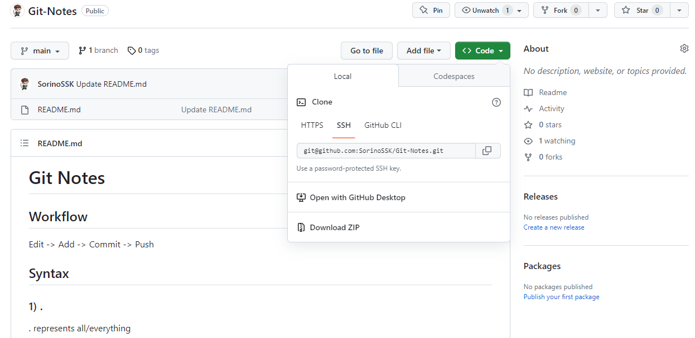

# Sin Kiat's Git Notes
This note contains a summarised list of commands for git.

## Git Workflow
<font size="5">Edit &rarr; Add &rarr; Commit &rarr; Push</font>

## Syntax
### 1) .
**.** represents all/everything

### 2) restore
Restore all modified code in your local file to initial. Restore function will not restore newly added files.
```
git restore .
```

### 3) add
Add creates a checkpoint of items modified in your local file. 
```
git add .
```

### 4) commit
Commit sets the closure for the list of checkpoint (add) made in your local file.  
You may or may not fill in (Your message). (Your message) will serve as a description for your modification.
```
git commit -m "(Your message)"
```
#### 4.1) Modify last commit message
You can modify the message of your last commit
```
git commit --amend
```
To save and quit the edit interface use the following command
```
:wq
```

### 5) branch
#### 5.1) View all local branch
You can view all branches created in your local repository using the following command.  
```
git branch
```
#### 5.2) View all available branch
If a branch to to appear when using the above command, then the branch is not pulled to your local repository. Therefore, to view branches of both local and remote repository, you will use the following command.
```
git branch -a
```
#### 5.3) View all remote branch
```
git branch -r
```

#### 5.4) Creating branch
Branch can be created on github webpage or on the command prompt. (BranchName) can be any unique name. Always ensure to check that your are on master before creating branch using ```git branch```. You may or may not use the convention ```branch-```.
```
git checkout -b branch-(BranchName)
```
Alternatively
```
git switch -c branch-(BranchName)
```
#### 5.5) Changing branch
You can change your working branch to another branch using ```checkout```.
```
git checkout branch-(BranchName)
```
***master*** is considered a branch.
```
git checkout master
```
There is an alternative method to switch branch without the need to commit your local repository.
```
git switch branch-(BranchName)
```

### 6) Status of a git repository
Status allows you to track changes made in your file.  
Red coded lines represents files that have not been added for push.  
Green coded lines represents files that have been added for push.
```
git status
```

### 7) push
#### 7.1) push changes to github on undefined branch
Creating a branch on your local terminal will create a branch on your local respository but not on github. (BranchName) is the name of the newly created branch. 
```
git push -u origin branch-(BranchName)
```
#### 7.2) push changes to existing branch
```
git push
```

### 8) pull
#### 8.1) Pull from other branch and overwrite current branch.
Overwrite all files of current branch with the intended branch.
```
git pull origin (BranchName)
```

### 9) Delete a branch
To use this command, the user must not be in the branch it is deleting.  
If changes have been made, you have to commit before changing branch and deleting it.
```
git branch --delete (BranchName)
```
Alternatively
```
git branch -D (BranchName)
```

### 10) Reset and update local file
```
git fetch --all
git reset --hard origin/master
```

### 11) Open Visual Studio Code using the terminal
You may use the following command to access your project file on the selected branch in visual studio.
```
code .
```
### 12) Clone a remote git repository to a folder.
```
git clone (copy command from repository).
```
For example:
```
git clone git@github.com:SorinoSSK/Git-Notes.git
```


## Generating SSH Key
You can use SSH connection instead of HTTPS for safer communication between git and your device. 

To use generate SSH:  
**A. Linux Steps:**  
&emsp;&emsp; 1) Type in the following in your console
```
ssh-keygen
```
&emsp;&emsp; 2) Press **enter** to store the SSH files in default directory.  
&emsp;&emsp; 3) Overwrite any existing SSH key if you have.  
&emsp;&emsp; 4) Leave passphase **empty** (Unless you needed it).  
&emsp;&emsp; 5) 2 SSH key files will be generated. 

Notes:  
1) default SSH key directory: /home/[username]/.ssh/id_rsa

**B. Windows Steps:**  
&emsp;&emsp; 1) Verify if OpenSSH is installed
&emsp;&emsp; 2) Type in the following in your console
```
ssh-keygen
```
&emsp;&emsp; 3) Press **enter** to store the SSH files in default directory.  
&emsp;&emsp; 4) Overwrite any existing SSH key if you have.  
&emsp;&emsp; 5) Leave passphase **empty** (Unless you needed it).  
&emsp;&emsp; 6) 2 SSH key files will be generated. 

Notes:  
1) default SSH key directory: C:\Users\\[username]/.ssh/

Generate file types
|File Name       | What?             |
|----------------|-------------------| 
|id_rsa          | private key       |
|id_rsa.pub      | public key        |